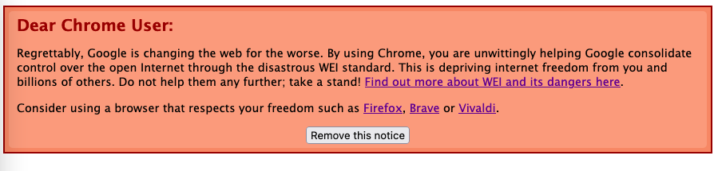

NO-WEI!
=========
A simple JavaScript banner for your website. It informs Google Chrome wielding netizens of the coming abhorrent attack on their freedom and privacy from proposed WEI (Web Environment Integrity) anti-feature.

The banner will only show for Chrome users. It will explain very briefly and politely why they should consider another browser. There is also a link to an online resource that informs of the dangers posed by WEI.

Finally, there is an option to hide the banner, with this preference stored in localstorage. This option may be switched off; that depends how strongly you feel. To switch off the dismissal option, set `allowDismissal = false` in `no-wei.js`.

A live example of how the banner will work in browsers [may be seen here](https://soft.thran.uk/no-wei.html). This example has UA detection turned off, so will be seen by all browsers.

# Why no WEI?
To quote Greg Farough of the Free Software Foundation:

"Before serving a web page, a server can ask a third-party "verification" service to make sure that the user's browsing environment has not been "tampered" with. A translation of the policy's terminology will help us here: this Google-owned server will be asked to make sure that the browser does not deviate in any way from Google's accepted browser configuration."

This means that the verification service controlled by Google can and *will* be used to exclude certain configurations of web browser from accessing websites that implement WEI. This will empower Google to refuse attestation to web browsers with advert blocking, web browsers on operating systems other than Windows/Apple/Android, users with stricter privacy preferences, web archiving services, competitors to Google, and anyone else their verification server deems invalid.

We can expect that such power entrusted with one corporation will be used to attack anything that goes against their chief business interest - namely advertising. The effect of this will be a serious detriment to the open web.

More details [here (OWD)](https://openwebdefenders.org/), [here (FSF)](https://www.fsf.org/blogs/community/web-environment-integrity-is-an-all-out-attack-on-the-free-internet) and [here (El Reg)](https://www.theregister.com/2023/07/27/google_web_environment_integrity/).

# Installing
Simply include the JavaScript and CSS at the top of your HTML. See `example.html` for an example. The exact steps follow anyway:

Copy `no-wei.css` and `no-wei.js` to your web page assets directory, then include a link to both in all your HTML documents/templates between the `<head> ... </head>` tags.

```
<link rel="stylesheet" type="text/css" href="$PATH_TO_CSS/no-wei.css">
<script type="text/javascript" src="$PATH_TO_JS/no-wei.js"></script>
```
This project is written in vanilla JavaScript and uses no dependencies (JQuery or anything).

# User-Agent Detection
Currently a bit basic but this is the quickest way I could make it work without relying upon dependencies. Our user agent detection simply checks the UA string for telling keywords and then deducts which browser is in use.

We currently show the banner only to Chrome. This may change; we could include other browsers when their position on WEI becomes clear. Currently, no concrete position on WEI has been given for Edge, Opera or Safari (though Safari uses its own equivalent PATs that are [allegedly more private](https://www.theregister.com/2023/07/27/google_web_environment_integrity/)).

Vivaldi will [usually send the same user agent as Chrome](https://vivaldi.com/blog/user-agent-changes/), sorry Vivaldi users, you'll get the banner too. This is also a problem with Brave.

[Sample User-Agent sources](https://developer.mozilla.org/en-US/docs/Web/HTTP/Headers/User-Agent) used for this project; it is MDN's fault if I got any wrong ;)

# Branching
Dev contains the latest untested commit, Master contains the stable version. It is this way because this project is too simple to have formal releases.

# Example image

